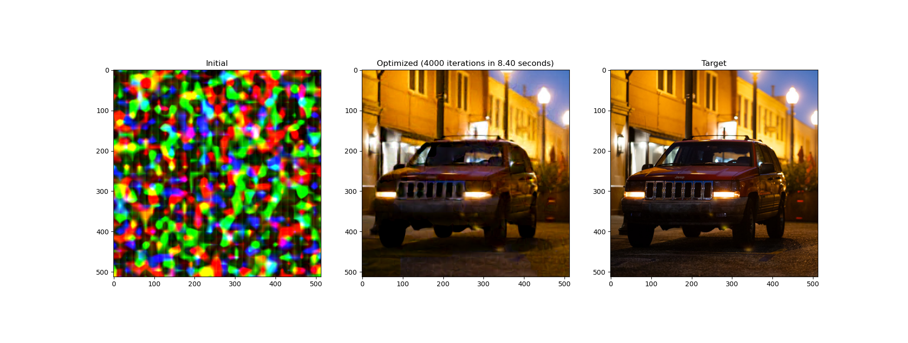

# Tensor-Core accelerated 'inline' neural models in Slang (using the CUDA WMMA API)

## What are inline neural models?
In this example, we implement & use the "tiny neural network" model that are now broadly used by high-performance neural, inverse & differentiable graphics pipelines, such as [Neural Appearance Models](https://research.nvidia.com/labs/rtr/neural_appearance_models/), [Neural Texture Compression](https://research.nvidia.com/labs/rtr/neural_texture_compression/), [Instant Neural Graphics Primitives](https://nvlabs.github.io/instant-ngp/), [Neural Radiance Caching](https://research.nvidia.com/publication/2021-06_real-time-neural-radiance-caching-path-tracing), [NeRF Shop (Jambon et al. 2023)](https://repo-sam.inria.fr/fungraph/nerfshop/) and many more!

### How are 'tiny' neural networks different from the usual deep networks?
The key characteristic of Tiny MLP pipelines is the decomposition of a large traditional deep network, such as the model proposed by [Neural Radiance Fields (Mildenhall et al. 2020)](https://www.matthewtancik.com/nerf), into a **latent feature code** stored on acceleration structures like octrees/mipmaps/hash-tables combined with a much smaller neural network evaluation, typically 2 to 5 layers of between 16x16 to 64x64 each.

### Why are they fast?
The result is a **much** faster pipeline that can be trained/evaluated in real-time. To realize the performance benefits, the entire chain of MLP evaluations as well as the backward pass are performed within a single kernel launch, which allows all intermediate state for each block of pixels to stay within fast on-chip memory (i.e. 'shared memory' or 'L2 cache')

### Why can't we implement this in PyTorch?
PyTorch's fundamental execution model launches a separate kernel for every operation, which necessitates storing data into global memory for the backward pass, and it is very difficult to implement a fully fused model.

As a result nearly all Tiny-MLP pipelines are implemented in low-level languages like CUDA/HLSL/GLSL, and since these are non-differentiable, the pipelines have hand-coded derivatives & are much trickier to modify for experimentation when compared to models written in PyTorch.

In this example we show an implementation of a Tiny-MLP model using CUDA's WMMA API, that uses Slang's differentiable programming features to encapsulate the complexity of inline evaluation behind a single layer implementation. 

We that show an example 2D image model that uses this MLP and relies on Slang's automatic differentiation to produce the derivative kernel. The result is a fast differentiable implementation that operates entirely on shared memory and is easy to read, modify & experiment with!

## Running the Code

You can run the given code by running 
```shell
python mlp_image_fit.py
```

Dependencies:
 - `slangpy` **v1.1.10** or later (`pip install slangpy`)
 - `torch` **2.0** or later with CUDA support (use the [torch website](https://pytorch.org/))
  
For visualization:
 - `matplotlib`
 - `cv2`

## Implementation Details

The code is structured as follows:
 1. Inline MLP implementation 
    1. `inline-mlp.slang`: 
        1. `Linear<C>`: Implements a linear layer ($\mathbf{x}^TW+b$) of size `C` through a low-level implementation that moves the input feature vectors & weights to dedicated shared memory space, then uses calls a CUDA-side `matmul` implementation. `eval` has a custom derivative called `eval_bwd` that uses the same approach to backprop derivatives to the input array and $W$ & $b$ tensors. 
        2. `MLP<C, N>`: Uses an array of `N` separate `Linear<C>` objects, and exposes a differentiable `eval` method that simply calls each layer & separates them through `ReLU`  non-linearities.
        3. `__inline_matmul<W, C, O, M, N, K>()`: A generalized **inline** mat-mul implementation designed to coordinate among the threads of a single warp to multiply a `WxC` and a `CxO` matrix to produce a `WxO` output. Note that the Slang-side implementation uses `__target_switch` & `__intrinsic_asm` to simply call into the CUDA-side implementation.
    2. `cuda_matmul_prelude.cuh`: A CUDA implementation of tensor-core accelerated matrix-multiply that adjusts to the matrix sizes by tiling as many tensor-core MMA operations as necessary for a single warp to compute the output.

 2. Example image model to demonstrate a Tiny-MLP-based pipeline
    1. `image-model.slang`: Implements a kernel that can be invoked from the python side by using the `[AutoPyBindCUDA]` attribute. 
        1. `computeInterpolatedFeature`: This takes a `featureGrid` tensor-view that is a 2D grid of randomly initialized `14`-element features, computes an interpolated feature for each pixel by finding its grid cell and applying bi-linear interpolation to the features from the four corners. Note that this process is entirely differentiable.
        2. `renderImage`: The entry-point for the Python-side. `renderImage` computes the interpolated feature, invokes our MLP and writes the output to our output image
     2. `image_model.py`: Loads `image-model.slang` using `slangpy` and wraps the functionality as a `torch.autograd.Function`. Note that since all Slang-side structures are automatically exported to python as `namedtuple` objects, the MLP input can be constructed by referring directly to the field names as defined in Slang.
     3. `mlp_image_fit.py` Runs a standard PyTorch-based optimization loop using this new image model to jointly optimize weights, biases and the feature grid. You should be able to see something similar to the following when it's done: 
     
     